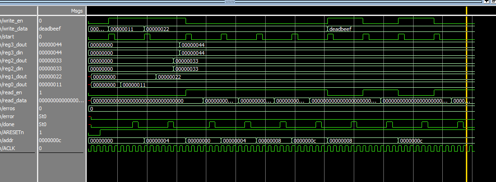
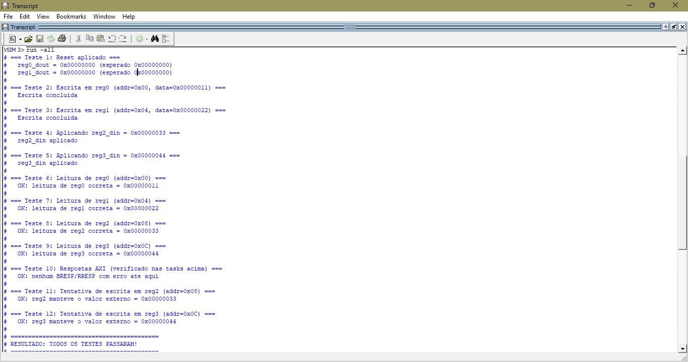

# Relatório – Integração AXI4-Lite Master com Periférico Subordinate

**Curso** CI Digital  
**Data:** 01/06/2025  
**Aluna:** Júlia de Freitas Carvalho

---

## 1. Introdução

Nessa atividade foi desenovlvido o módulo Master para o AXI4-Lite em SystemVerilog e criado a conexão com periférico subordinate que foi feito na atividade anterior (26/05). A ideia era entender como funcionam as conexões e transações no barramento AXI4-Lite entre mestre e escravo.

O sistema completo ficou com 4 arquivos principais:

- `axi4_lite_master.sv` – o master novo que foi implementado
- `axi4_lite_subordinate.sv` – o subordinate da atividade anterior (com o módulo renomeado)
- `axi4_lite_system_top.sv` – módulo que conecta os dois
- `tb_axi4_lite_system.sv` – testbench com os 12 testes pedidos

---

## 2. Funcionamento do Master

O master foi implementado com uma máquina de estados (FSM) simples com 6 estados:

| Estado | O que faz |
|--------|-----------|
| `IDLE` | Espera o sinal `start` do testbench |
| `WR_ADDR` | Coloca endereço e dado nos canais AW e W e espera os handshakes |
| `WR_BRESP` | Espera o subordinate confirmar a escrita pelo canal B |
| `RD_ADDR` | Coloca endereço no canal AR e espera o handshake |
| `RD_DATA` | Espera o subordinate colocar o dado no canal R |
| `DONE_ST` | Pulsa o sinal `done` por 1 ciclo e volta pro IDLE |

### Escrita:

O testbench seta `write_en=1`, `addr`, `write_data` e pulsa `start`. O master então:

1. Coloca o endereço em `AWADDR` e ativa `AWVALID`
2. Ao mesmo tempo coloca o dado em `WDATA` e ativa `WVALID`
3. Espera o subordinate ativar `AWREADY` e `WREADY` (handshake dos dois canais)
4. Ativa `BREADY` e vai pro estado `WR_BRESP`
5. Quando o subordinate ativa `BVALID`, a escrita está concluída
6. Vai pro `DONE_ST`, pulsa `done=1` e volta pro `IDLE`

### Leitura:

O testbench seta `read_en=1`, `addr` e pulsa `start`. O master então:

1. Coloca o endereço em `ARADDR` e ativa `ARVALID`
2. Espera o subordinate ativar `ARREADY` (handshake do canal AR)
3. Ativa `RREADY` e vai pro estado `RD_DATA`
4. Quando o subordinate ativa `RVALID` com o dado em `RDATA`, captura o valor
5. Vai pro `DONE_ST`, pulsa `done=1` com o dado em `read_data`

---

## 3. Conexão Master ↔ Subordinate

A conexão é direta por fios internos no módulo top. Cada sinal do master vai para o sinal equivalente do subordinate conforme a especificação AXI4-Lite:

```
Master                 Subordinate
M_AXI_AWADDR    →    S_AXI_AWADDR
M_AXI_AWVALID   →    S_AXI_AWVALID
M_AXI_AWREADY   ←    S_AXI_AWREADY
M_AXI_WDATA     →    S_AXI_WDATA
M_AXI_WVALID    →    S_AXI_WVALID
M_AXI_WREADY    ←    S_AXI_WREADY
M_AXI_BRESP     ←    S_AXI_BRESP
M_AXI_BVALID    ←    S_AXI_BVALID
M_AXI_BREADY    →    S_AXI_BREADY
M_AXI_ARADDR    →    S_AXI_ARADDR
M_AXI_ARVALID   →    S_AXI_ARVALID
M_AXI_ARREADY   ←    S_AXI_ARREADY
M_AXI_RDATA     ←    S_AXI_RDATA
M_AXI_RRESP     ←    S_AXI_RRESP
M_AXI_RVALID    ←    S_AXI_RVALID
M_AXI_RREADY    →    S_AXI_RREADY
```

O subordinate (`reg2_din` e `reg3_din`) recebe valores externos diretamente do testbench, simulando entradas de hardware como sensores ou flags de status.

---

## 4. Mapeamento de Registradores

O mapeamento foi o mesmo da atividade anterior:

| Endereço | Registrador | Tipo | Acesso |
|----------|-------------|------|--------|
| 0x00 | reg0 | Controle/Dado | Leitura e escrita |
| 0x04 | reg1 | Controle/Dado | Leitura e escrita |
| 0x08 | reg2 | Status externo | Somente leitura via AXI |
| 0x0C | reg3 | Status externo | Somente leitura via AXI |

Tentativas de escrita em reg2 e reg3 são ignoradas pelo subordinate e os valores vêm sempre das entradas `reg2_din` e `reg3_din`.

---

## 5. Resultados da Simulação

Simulação no ModelSim:



Os sinais observados confirmam o handshake correto nos canais AW, W, B, AR e R, pois, é possível observar a escrita e leitura dos valores nos registradores e nas estruturas de controle como esperado, além da devida comunicação entre os dois módulos (master e subordinate).


O testbench foi executado com todos os 12 testes da especificação. A saída esperada no console é:




---

## 6. Conclusão

A atividade foi bem útil para entender como o master e o subordinate AXI4-Lite interagem entre si. Deu pra ver claramente na prática o fluxo de handshake de cada canal e como o subordinate responde às transações. A FSM do master ficou simples e funcional, cobrindo os casos de escrita e leitura com verificação das respostas BRESP e RRESP.
