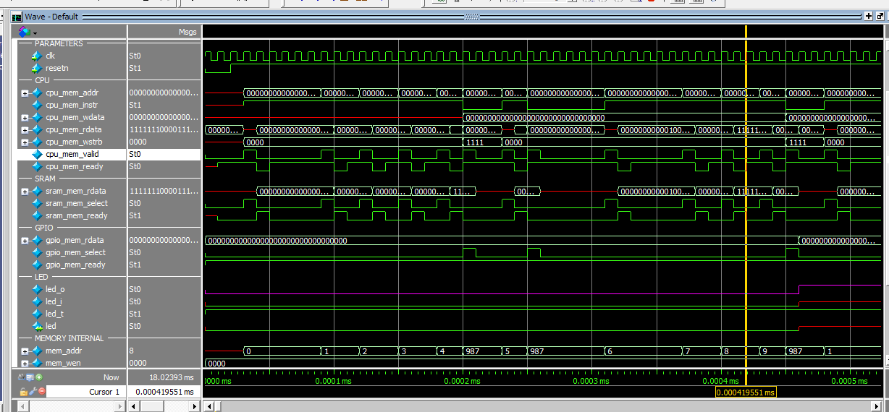

# Relatório – Análise e Simulação de um SoC com PicoRV32

**Aluna:** Júlia de Freitas Carvalho

**Data:** 09/06/2026

---

## 1. Estrutura do projeto

O projeto implementa um SoC (System on Chip) bem simples de um processador RISC-V conectado a uma memória RAM e a um periférico GPIO, tudo num único módulo topo. Para isso, os arquivos são:

| Arquivo | O que é |
|---|---|
| `fpga_rv32.v` | Módulo topo, responsável por integrar tudo |
| `picorv32.v` | Core do processador RISC-V (PicoRV32) |
| `ram_32bits.v` | Memória RAM de 32 bits |
| `gpio_simple.v` | Controlador GPIO para o LED |
| `alt_iobuf.vhd` | Buffer bidirecional para o pino físico do LED |
| `firmware.hex.txt` | Programa em hexadecimal que roda no processador |
| `testbench.v` | Testbench da simulação |

---

## 2. Descrição dos Módulos

### `fpga_rv32.v`

Esse é o arquivo principal (módulo topo), que conecta todos os outros. Dentro dele o processador, a memória e o GPIO são instanciados e ligados entre si pelo barramento de memória do PicoRV32.

Algumas definições importantes que estão nesse arquivo:

```verilog
localparam STACK_ADDR    = 32'h0000_0000;  // endereço do stack
localparam RAM_ADDR      = 32'h0001_0094;  // onde a RAM começa
localparam RAM_NWORDS    = 1024;           // tamanho da RAM: 1024 palavras de 32 bits
localparam GPIO_LED_ADDR = 32'h0002_0000;  // endereço do GPIO
```

O processador tem um barramento de leitura que vai pra `cpu_mem_rdata`. Para saber qual módulo responde naquele momento (RAM ou GPIO), tem um decodificador de endereços que olha o `sram_mem_select` e `gpio_mem_select` e usa um mux para escolher qual dado vai pro processador.

### `picorv32.v`

É o módulo do processador core RISC-V PicoRV32, implementado em Verilog. Ele tem uma interface de memória simples onde o processador coloca o endereço em `mem_addr`, sinaliza que quer ler ou escrever com `mem_valid`, e espera `mem_ready` voltar antes de continuar.

No topo, ele foi configurado com:
- Barrel shifter e ISA comprimida habilitados
- Multiplicação e divisão habilitados
- IRQ desabilitado (nesse projeto não tem tratamento de interrupção)
- PC inicial em `RAM_ADDR` (começa a executar da RAM)
- Stack em `STACK_ADDR`

### `ram_32bits.v` 

Módulo que descreve uma memório RAM simples de 32 bits com suporte a escrita seletiva por byte (usando `wstrb`). Ela tem um chip select que ativa só quando o endereço está dentro da faixa da RAM.

### `gpio_simple.v`

Controlador de GPIO com suporte a configuração por parâmetros. Nesse projeto foi instanciado com `NUM_GPIO=1` (pino para o LED). Quando o processador escreve no endereço `0x0002_0000`, o valor vai pro registrador de saída e aparece no pino físico. O pino está configurado sempre como saída (`pin_t = 1'b1`).

### `alt_iobuf.vhd`

É uma primitiva do FPGA que implementa um buffer bidirecional para o pino físico. Quando `oe=1` (output enable), o pino é dirigido pelo sinal `i`. Sempre tem `oe=pin_t=1'b1`, então o pino está sempre como saída nesse projeto.

### `testbench.v`

O módulo do testbench é bem simples, nele é gerado um clock de 10 ns de período, onde a logica começa com o reset ativo e após 20 ns o reset é liberado. Com isso o processador começa a executar o firmware.

```verilog
always #5 clk = ~clk;  // clock de 10 ns

initial begin
    #20 resetn = 1;    // solta o reset depois de 20 ns
end
```

---

## 3. Simulação

A simulação foi executada no ModelSim com o testbench `testbench.v`.




O comportamento esperado na simulação segue exatamente o que o firmware faz:

1. Nos primeiros 20 ns o processador fica em reset e todos os sinais internos estão em estado inicial
2. Depois do reset, o processador começa a buscar instrução no endereço `0x0001_0094` (posição da RAM)
3. O barramento de memória começa a ficar ativo: `mem_valid` sobe, o processador coloca o endereço e espera `mem_ready`
4. A RAM responde com a instrução, o processador decodifica e executa
5. Quando chega no `SW x6, 0(x5)` (store no GPIO), dá pra ver o endereço `0x0002_0000` no barramento e o GPIO select ativando
6. O sinal `led_o` muda conforme o firmware escreve 0 ou 1 no registrador GPIO

---

## 4. Conversão do firmware para assembly

O arquivo `firmware.hex.txt` contém o programa em formato hexadecimal, uma instrução de 32 bits por linha. Decodificando cada instrução para RISC-V assembly:

| Endereço | Hex | Assembly | O que faz |
|---|---|---|---|
| 0x0001_0094 | `000202b7` | `lui x5, 0x20` | x5 = 0x00020000 (endereço do GPIO) |
| 0x0001_0098 | `00000313` | `addi x6, x0, 0` | x6 = 0 |
| 0x0001_009C | `0062a023` | `sw x6, 0(x5)` | escreve 0 no GPIO → LED OFF |
| 0x0001_00A0 | `0002a303` | `lw x6, 0(x5)` | lê o GPIO de volta pra x6 |
| 0x0001_00A4 | `fff34313` | `xori x6, x6, -1` | inverte todos os bits de x6 |
| 0x0001_00A8 | `0062a023` | `sw x6, 0(x5)` | escreve x6 invertido no GPIO |
| 0x0001_00AC | `00100313` | `addi x6, x0, 1` | x6 = 1 |
| 0x0001_00B0 | `0062a023` | `sw x6, 0(x5)` | escreve 1 no GPIO → LED ON |
| 0x0001_00B4 | `fe1ff06f` | `jal x0, -32` | volta 32 bytes (8 instruções atrás) |


### O que o programa faz

O código funciona em loop infinito. A cada iteração:

1. Zera x6 e escreve no GPIO → **LED apaga**
2. Lê o GPIO de volta (lê 0)
3. Inverte todos os bits (0 → 0xFFFFFFFF)
4. Escreve o valor invertido no GPIO → **LED acende**
5. Carrega 1 em x6 e escreve no GPIO → **LED permanece aceso**
6. Volta para o início

Na prática, o LED fica alternando entre apagado e aceso a cada volta do loop, mas sem nenhum delay, a comutação acontece na frequência do clock. Num FPGA real, o piscar seria muito rápido pra enxergar, mas na simulação dá pra ver a troca do sinal `led_o` entre 0 e 1.

Em C, o código seria mais ou menos assim:

```c
volatile int *led = (int *)0x00020000;

while (1) {
    *led = 0;           // LED OFF
    *led = ~(*led);     // inverte (LED ON)
    *led = 1;           // LED ON
}
```

---

## 5. Conclusão

A atividade ajudou a entender como um SoC simples se organiza na prática. O que ficou mais claro foi ver como o processador, a memória e o periférico se comunicam pelo mesmo barramento de memória — tudo mapeado em endereços diferentes e separado por decodificação de endereço. O firmware em hex pareceu complicado à primeira vista, mas decodificando instrução por instrução ficou bem simples: é só um loop que acende e apaga o LED. A parte de entender o decodificador de endereços no módulo top e como o GPIO se conecta ao buffer bidirecional foi o que exigiu mais atenção.
