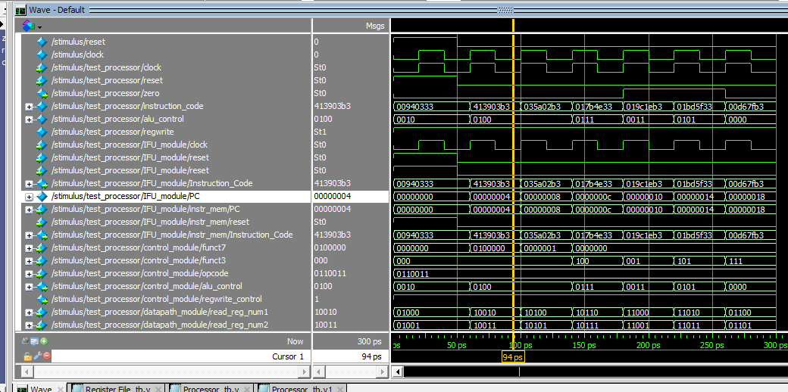
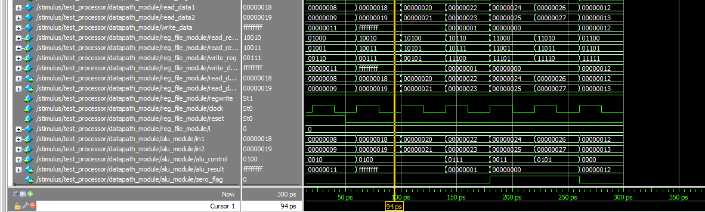

# Relatório – Análise e Simulação de um Processador RISC-V em Verilog

**Aluna:** Júlia de Freitas Carvalho

**Data:** 11/06/2026

**Repositório:** https://github.com/ash-olakangal/RISC-V-Processor


## 1. Introdução

O repositório citado na atividade descreve um processador RISC-V de 32 bits em Verilog. Nesse projeto, para simplificação do circuito, são implementadas somente instruções do tipo R, que são aquelas que realizam operações entre dois registradores (soma, subtração, multiplicação, and, or, xor e deslocamento).


## 2. Estrutura do repositório

Cada bloco do processador tem sua própria pasta na raiz do repositório, e cada pasta possui um testbench próprio para testar aquele bloco isoladamente. Ao final, a pasta `Processor` reúne todos os módulos.

A seguir a descrição da função dos principais pastas do porjeto:

| Pasta | Arquivos | Conteúdo |
|---|---|---|
| `ALU/` | `ALU.v` | ALU testada isoladamente |
| `Control Unit/` | `CONTROL.v` | Unidade de controle testada isoladamente |
| `Datapath/` | `Datapath.v` | Registrador + ALU testados juntos |
| `Instruction Fetch Unit/` | `IFU.v`, `INST_MEM.v` | Busca de instrução testada isoladamente |
| `Register file/` | `REG_FILE.v` | Banco de registradores testado isoladamente |
| `Processor/` | `PROCESSOR.v`, `ALU.v`, `CONTROL.v`, `DATAPATH.v`, `IFU.v`, `INST_MEM.v`, `REG_FILE.v`, `Processor_tb.v` | Processador completo e testbench final |

O módulo principal do processador é o `PROCESSOR.v`, dentro da pasta `Processor`. O testbench que roda o processador completo é o `Processor_tb.v`. O arquivo `output_wave.vcd` não é fixo no repositório, é gerado a cada execução da simulação.


## 3. Arquitetura do processador

O módulo topo `PROCESSOR` organiza e estrutura o processador em três estágios: busca, decodificação e execução. Cada um desses estágios corresponde a um módulo instanciado dentro do `PROCESSOR`:

```verilog
module PROCESSOR( 
    input clock, 
    input reset,
    output zero
);
    IFU IFU_module(clock, reset, instruction_code);
    CONTROL control_module(instruction_code[31:25], instruction_code[14:12],
                           instruction_code[6:0], alu_control, regwrite);
    DATAPATH datapath_module(instruction_code[19:15], instruction_code[24:20], 
                             instruction_code[11:7], alu_control, regwrite, 
                             clock, reset, zero);
endmodule
```

O `PROCESSOR` não decodifica, ele apenas repassa pedaços fixos da instrução para cada módulo de acordo com o formato de instrução tipo R no RISC-V. Os módulos principais que compõem o projeto podem ser vistos na tabela a seguir: 

| Módulo | Função | Entradas principais | Saídas principais |
|---|---|---|---|
| `IFU` | Busca a instrução na memória . Contém o contador de programa (PC) | `clock`, `reset` | `Instruction_Code` |
| `INST_MEM` | Armazena as instruções do programa  | `PC`, `reset` | `Instruction_Code` |
| `CONTROL` | Decodifica os campos da instrução e gera o comando da ALU | `funct7`, `funct3`, `opcode` | `alu_control`, `regwrite_control` |
| `REG_FILE` | Banco de 32 registradores de 32 bits | endereços de leitura/escrita, `regwrite`, `clock`, `reset` | `read_data1`, `read_data2` |
| `ALU` | Responsável por executar a operação indicada (soma, subtração, and, or, xor, shift, multiplicação) | dois operandos de 32 bits, `alu_control` | `alu_result`, `zero_flag` |
| `DATAPATH` | Conecta o `REG_FILE` e a `ALU` | endereços de registrador, `alu_control`, `regwrite`, `clock`, `reset` | `zero` |
| `PROCESSOR` | Módulo topo; conecta `IFU`, `CONTROL` e `DATAPATH` | `clock`, `reset` | `zero` |

Como o projeto implementa apenas instruções tipo R, o caminho de dados é direto: os dois valores lidos no `REG_FILE` sempre alimentam a `ALU`, e o resultado da `ALU` é sempre o dado escrito de volta no `REG_FILE`. Além disso, também não há memória de dados nem tratamento de desvio (branch/jump), o PC apenas soma 4 a cada ciclo de clock.


## 4. Fluxo de execução de uma instrução

Instrução analisada: `add t1, s0, s1` (primeira instrução carregada na memória).

Decodificação: 
- `opcode = 0110011` (tipo R)
- `funct7 = 0000000` e `funct3 = 000` (soma)
- `rs1 = s0` (registrador 8)
- `rs2 = s1` (registrador 9)
- `rd = t1` (registrador 6)

Fluxo da instrução: 

1. **Busca:** o `IFU` lê a instrução na `INST_MEM` usando o PC, que começa em 0.
2. **Decodificação:** o `CONTROL` recebe `funct7`, `funct3` e `opcode`, identifica a soma e envia `alu_control = 4'b0010` para a ALU, liberando `regwrite_control = 1`.
3. **Leitura dos registradores:** o `DATAPATH` lê s0 e s1 no `REG_FILE` (s0 = 8, s1 = 9).
4. **Execução na ALU:** soma dos operandos, 8 + 9 = 17.
5. **Acesso à memória:** não ocorre, o processador não possui memória de dados.
6. **Escrita do resultado:** o valor 17 é escrito no registrador t1 no próximo pulso de clock.
7. **Atualização do PC:** o PC passa de 0 para 4, apontando para a próxima instrução (`sub t2, s2, s3`).


## 5. Simulação

**Ferramenta:** ModelSim, usando o testbench principal do processador (`Processor_tb.v`), que instancia o processador completo através do módulo `test_processor`.

**Comandos executados:**

```
vlib work
vlog PROCESSOR.v IFU.v INST_MEM.v CONTROL.v DATAPATH.v REG_FILE.v ALU.v Processor_tb.v
vsim stimulus
add wave -r /stimulus/*
run -all
```

Foi-se necessário adicionar `add wave -r` porque, adicionando os sinais sem o `-r` (recursivo), só aparecem `clock`, `reset` e `zero`, os sinais internos do processador (PC, instrução, `alu_control` etc.) ficam escondidos dentro das instâncias, e só são exibidos quando toda a hierarquia é adicionada de uma vez.

**Print da forma de onda:**




Dessa forma, dá para acompanhar as instrução ao mesmo tempo no código bruto (`instruction_code`), no comando gerado pela unidade de controle (`alu_control`) e nos operandos/resultado dentro da ALU (`in1`, `in2`, `alu_result`). Os valores lidos na forma de onda foram:

| PC | Instrução | `alu_control` | `in1`, `in2` | `alu_result` |
|---|---|---|---|---|
| 0x00 | `add t1, s0, s1` | `0010` (ADD) | 8, 9 | `00000011` (17) |
| 0x04 | `sub t2, s2, s3` | `0100` (SUB) | 24, 25 | `ffffffff` (-1) |
| 0x08 | `mul t0, s4, s5` | `0100` (SUB) | 32, 33 | `ffffffff` (-1) |
| 0x0c | `xor t3, s6, s7` | `0111` (XOR) | 34, 35 | `00000001` |
| 0x10 | `sll t4, s8, s9` | `0011` (SLL) | 36, 37 | `00000000` |
| 0x14 | `srl t5, s10, s11` | `0101` (SRL) | 38, 39 | `00000000` |
| 0x18 | `and t6, a2, a3` | `0000` (AND) | 18, 19 | `00000012` (18) |

O `PC` avança de 4 em 4 a cada ciclo de clock, o `write_reg` acompanha o registrador de destino de cada instrução (`00110`=t1, `00111`=t2, `00101`=t0, `11100`=t3...) e o `regwrite` permanece em 1 durante toda a execução, liberando a escrita.

Pode-se notar qu eo porjeto em questão foi capaz de ler as instruções, realizar os calculos e  troca de informações e comunicão entre os diferentes módulos do processador.

## 7. Conclusão

A atividade permitiu identificar, em um código real, os blocos que compõem um processador RISC-V básico como o contador de programa, memória de instruções, unidade de controle, banco de registradores e ALU, além de entender como esses blocos se comunicam a cada ciclo de clock.

O processador analisado é limitado a instruções do tipo R, não possui memória de dados, instruções de desvio ou multiplexadores. Para se tornar um processador RISC-V completo, seria necessário implementar a decodificação dos demais formatos de instrução (I, S, B, U, J), uma memória de dados e os multiplexadores responsáveis por selecionar a origem do dado escrito no banco de registradores.
