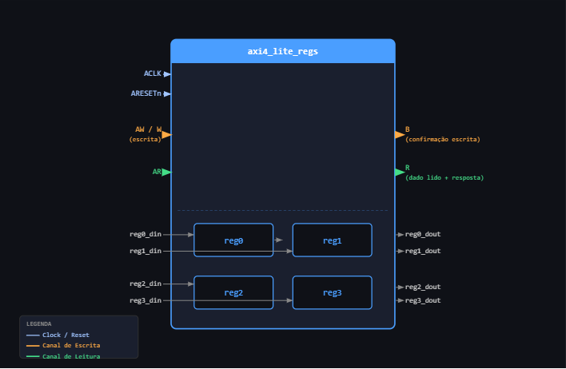
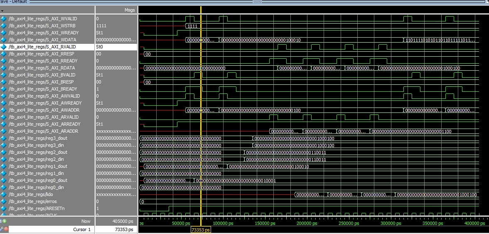
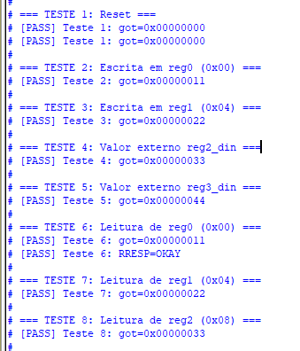
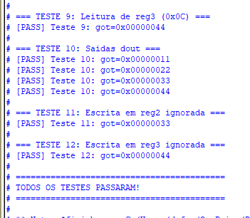

# Relatório – Periférico AXI4-Lite com Banco de Registradores

**Aluna:** Júlia de Freitas Carvalho

**Data:** 26/05/2025

---

## 1. Introdução

A atividade pediu para implementar, em Verilog, um periférico que conversa com um processador usando o protocolo AXI4-Lite. A ideia é que o processador consiga ler e escrever em quatro registradores de 32 bits, cada um em um endereço de memória diferente. Dois desses registradores são controlados pelo próprio processador, e os outros dois refletem valores que chegam de fora do circuito.

---

## 2. Descrição do módulo

O módulo implementado `axi4_lite_regs` funciona como uma ponte entre o barramento e quatro registradores internos. O processador acessa esses registradores mandando pedidos de leitura ou escrita com um endereço, e o módulo responde de acordo com aquele endereço.

Os quatro registradores têm comportamentos diferentes:

- **reg0 e reg1** são registradores de controle. O processador pode escrever e ler neles normalmente. O valor só muda quando o processador manda uma escrita.
- **reg2 e reg3** são registradores de status. Eles não aceitam escrita pelo barramento — eles só mostram o que está chegando pelas entradas externas `reg2_din` e `reg3_din`. O processador pode ler esses valores, mas não pode alterá-los.

---

## 3. Diagrama do bloco

Do lado esquerdo entram o clock, o reset, os pedidos de leitura e escrita via barramento, e os dois sinais externos de status. Do lado direito saem as respostas do barramento e os valores atuais dos quatro registradores, que ficam disponíveis o tempo todo nas saídas `_dout`.

---

## 4. Tabela de mapeamento de endereços

| Endereço | Registrador | Tipo | `localparam` no código |
|---|---|---|---|
| 0x00 | reg0 | Controle | `ADDR_REG0 = 32'h00` |
| 0x04 | reg1 | Controle | `ADDR_REG1 = 32'h04` |
| 0x08 | reg2 | Status | `ADDR_REG2 = 32'h08` |
| 0x0C | reg3 | Status | `ADDR_REG3 = 32'h0C` |

Os endereços avançam de 4 em 4 porque cada registrador tem 32 bits, o que equivale a 4 bytes. No código, esses endereços foram definidos como constantes (`localparam`) para evitar números soltos no meio do `case` e facilitar a leitura.

---

## 5. Especificações do projeto

### O módulo fica sempre pronto para receber

O módulo principal foi configurado para estar sempre pronto para aceitar um endereço ou dado, sem precisar esperar nenhuma condição especial. Isso significa que os sinais `AWREADY`, `WREADY` e `ARREADY` ficam em `1` praticamente o tempo todo (depois do reset). Essa decisão simplifica bastante o código e o testbench.

### Escrita e endereço chegando juntos

Para que a escrita aconteça, o código verifica se o endereço e o dado chegaram ao mesmo tempo e foram aceitos. Só aí o valor é gravado no registrador certo. Se só um dos dois chegou, ele espera até o outro aparecer.

### Endereço inválido na leitura

Se alguém tentar ler um endereço que não existe, o módulo devolve o valor `0xDEADBEEF` como sinalização de erro na leitura.

### Reset

Quando o reset é ativado (sinal `ARESETn = 0`), todos os registradores voltam para zero e todos os sinais de saída do barramento são desligados. O módulo só começa a funcionar quando o reset é liberado.

---

## 6. Funcionamento da comunicação

### Escrita: 

1. O processador coloca o endereço que quer escrever no sinal `AWADDR` e sinaliza que é válido com `AWVALID = 1`
2. O módulo responde com `AWREADY = 1`, confirmando que recebeu o endereço
3. O processador manda o dado em `WDATA` e sinaliza com `WVALID = 1`
4. O módulo responde com `WREADY = 1`
5. Com endereço e dado confirmados, o módulo grava o valor no registrador correto
6. O módulo levanta `BVALID = 1` com `BRESP = 00` (código de "tudo certo")
7. O processador confirma que leu a resposta com `BREADY = 1`
8. O módulo baixa `BVALID` e a transação termina

### Leitura:

1. O processador coloca o endereço que quer ler em `ARADDR` e sinaliza com `ARVALID = 1`
2. O módulo responde com `ARREADY = 1` e já coloca o valor do registrador em `RDATA`
3. O módulo levanta `RVALID = 1` com `RRESP = 00`
4. O processador lê o dado e confirma com `RREADY = 1`
5. O módulo baixa `RVALID` e a transação termina

---

## 7. Resultados dos testes

Para comprovar que tudo funcionou, foi criado um testbench que simula o processador conversando com o módulo. Foram 12 testes no total, cobrindo todos os casos pedidos na atividade.

1. Reset zera todos os registradores 
2. Escrita no reg0 com valor 0x00000011 
3. Escrita no reg1 com valor 0x00000022 
4. Entrada externa reg2_din com valor 0x00000033 
5. Entrada externa reg3_din com valor 0x00000044 
6. Leitura do reg0 via barramento (incluindo verificação da resposta) 
7. Leitura do reg1 via barramento 
8. Leitura do reg2 via barramento 
9. Leitura do reg3 via barramento 
10. Verificação de todas as saídas _dout ao mesmo tempo 
11. Tentativa de escrita no reg2 
12. Tentativa de escrita no reg3  

### Logs da simulação no ModelSim

Os registradores de controle (reg0 e reg1) guardaram corretamente os valores escritos pelo barramento. Os registradores de status (reg2 e reg3) acompanharam corretamente as entradas externas e ignoraram as tentativas de escrita pelo barramento. As leituras devolveram os valores certos em todos os endereços. As respostas de confirmação de escrita e leitura sempre vieram com o código `00`, que significa "tudo certo" dentro do protocolo.

---

## 8. Conclusão

A implementação atendeu todos os requisitos pedidos na atividade. O módulo consegue receber escritas e leituras via barramento, manter os valores nos registradores de controle, espelhar as entradas externas nos registradores de status, e responder corretamente para o processador em todas as operações. A simulação comprovou o funcionamento correto em todos os 12 casos de teste obrigatórios.
