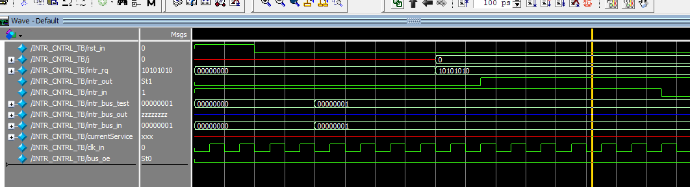

# Relatório – Análise de Controlador de Interrupções

**Aluna:** Júlia de Freitas Carvalho

**Data:** 29/05/2026

---

## 1. Objetivo geral do repositório

O repositório `adibis/Interrupt_Controller` tem a implementação de um controlador de interrupções com 8 entradas, feito em Verilog. A ideia geral é ter um componente que fica analisando contínuamente vários periféricos e avisa o processador quando algum deles precisa de atenção (gera uma interrupção), ele funciona como um intermediário entre os periféricos e o processador. O projeto é composto por uma pasta com o código do controlador e outra com o testbench pra simulação, além de um README que explica como o código funciona.

## 2. Quantas entradas de interrupção o controlador suporta?

O código suporta até **8 entradas**, representadas pelo sinal `intr_rq[7:0]`. Cada bit do vetor representa uma porta para receber uma interrupção diferente, ou seja, cada periférico tem o seu próprio bit pra informar a interrupção.

## 3. Arquivos presentes na pasta `src`

A pasta src possui apenas um arquivo, sendo ele o módulo do projeto:

- **`intrCntrl.v`**: módulo onde fica toda a lógica do controlador, incluindo: a máquina de estados, os registradores, a tabela de prioridades e a definição dos sinais de entrada e saída.

## 4. Arquivos presentes na pasta `testbench`

A pasta do testbench também possui apenas um arquivo, sendo ele o teste do módulo `intrCntrl.v`.

- **`intrCntrl_tb.v`**: o testbench que assume o papel do processador na simulação. Ele gera o clock, faz o reset, levanta os pedidos de interrupção e realiza toda a troca de sinais com o controlador pra checar se está funcionando devidamente.

## 5. Sinais que representam as fontes de interrupção

As fontes de interrupção são o sinal `intr_rq[7:0]`. Cada bit é representa um periférico, quando o periférico gera uma interrupção, o código seta o bit que o representa para `1`. Por exemplo, se só o periférico 0 tiver gerando interrupções e pedindo preferencia, `intr_rq` vai estar em `8'b0000_0001`.

## 6. Sinal que indica ao processador que existe uma interrupção ativa

O sinal que representa uma interrupção ativa é `intr_out`. Quando o controlador acha alguma interrupção pendente, ele levanta esse sinal pra chamar o processador. Junto com ele tem o `intr_bus[7:0]`, que é o barramento usado pra passar mais detalhes, como por exemplo, qual é a fonte ou o código da operação.

## 7. Como funciona o modo polling?

No modo polling o controlador vai checando as fontes **em ordem**, no caso, de 0 até 7. Quando essa verificação acha uma interrupção ativa, ele starta um protocolo de comunicação com o processador:

1. Levanta o `intr_out` pra simbolizando que tem interrupções detectadas.
2. Espera o processador dar um pulso em `intr_in` confirmando que recebeu
3. Coloca no barramento o código `01011` junto com o número da fonte
4. Espera o processador tratar a interrupção e mandar de volta `10100` com o mesmo ID confirmando que terminou
5. Se os códigos baterem, marca como tratada e segue pra próxima

O polling funciona basicamente como uma varredura em loop, ele vai de 0 a 7, trata o que tiver ativo e recomeça.

## 8. Como funciona o modo custom priority?

Nesse modo o controlador não vai mais em ordem fixa. Antes de começar, o processador manda uma tabela dizendo qual fonte é mais importante (prioridade entre os periféricos). O controlador guarda tudo num registrador interno e, a partir daí, verifica as fontes da mais prioritária pra menos prioritária.

Nesse caso, o controlador manda `10011`, e a resposta esperada do processador é `01100`.

## 9. Função do sinal de acknowledgement do processador

O `intr_in` é a forma do processador responder pro controlador. Sem ele, o controlador não sabe se o processador já recebeu a informação ou já terminou de atender a interrupção, então ele simplesmente trava esperando.

Esse sinal aparece em dois momentos:

- **Primeiro pulso**: o processador faz `intr_in` descer e subir pra sinalizar detecção e informar que já pode er enviado as informações.
- **Segundo pulso**: depois de terminar o atendimento, o processador faz outro pulso pra dizer "pronto, pode continuar"

## 10. O que acontece após o reset do controlador?

Quando `rst_in` vai pra `1`, o controlador volta do zero, reseta o estado inicial da máquina e mantém os registradores zerados, `intr_out` desligado e a tabela de prioridades limpa. Depois que o reset é liberado, ele fica esperando o processador mandar o comando de configuração pra definir em qual modo vai operar.

## 11. Como o testbench estimula o controlador?

O testbench simula tudo que o processador faria. Ele começa gerando o clock (10 ns de período), aplica o reset pra garantir um estado inicial limpo, depois manda o comando de modo de operação pelo barramento. Com isso feito, ativa as fontes de interrupção colocando um padrão em `intr_rq`, como por exemplo `8'b1010_1010`, para ativar fontes alternadas. Após isso, é realizado o handshake completo com o controlador: espera o `intr_out` subir, confirma com `intr_in`, lê o barramento pra checar o código e o ID e manda a confirmação de término.

## 12. Quais situações o testbench cobre?

O testbench cobre duas situações diferentes: 

**Modo polling**: o código ativa 4 fontes alternadas (1, 3, 5 e 7) e verifica se o controlador detecta e atende cada uma em ordem. Na metade do teste muda as fontes ativas pra 0, 2, 4 e 6 pra ver se o controlador se adapta.

**Modo de prioridade**: ele configura uma tabela bem específica (`5 → 3 → 7 → 0 → 4 → 2 → 6 → 1`), ativa as 8 fontes de uma vez e vai verificando se elas são atendidas nessa ordem. Tem também alguns ciclos onde uma fonte é desativada e reativada no meio pra testar esse caso específico.

Caso qualquer verificação falhe, o testbench termina a simulação na hora com `$finish`.

## 13. Diferença entre polling e interrupção

No **polling** é o processador fica em loop perguntando pra cada periférico "você precisa de alguma coisa?", mesmo quando não tem nada acontecendo. Apesar de ser eficaz na detecção, ele acaba sendo ineficiente porque além de desperdiçar tempo fazendo essas verificações à toa o processador fica ocupado durante o loop gastando recursos.

Já na **interrupção** é o contrário: o periférico é quem chama o processador quando precisa. O processador fica livre fazendo outras coisas e só para quando é chamado.

O que é interessante nesse controlador é que ele usa uma lógica tipo polling internamente, ele varre as fontes uma a uma mas pro processador o esquema funciona como interrupção, porque o processador não precisa verificar nada, só espera o `intr_out` subir.

## 14. Por que um controlador de interrupções é útil em um SoC?

Num SoC tem vários periféricos funcionando juntos, como UART, SPI, timers, GPIO, etc. Se o processador fosse verificar cada um manualmente o tempo todo, gastaria a maior parte do tempo só nisso. O controlador de interrupções resolve isso sendo o intermediário, pois ele monitora tudo, organiza as prioridades e só chama o processador quando tem algo relevante. Isso libera o processador pra fazer o trabalho de verdade.

## 15. O que seria necessário acrescentar para aproximar esse controlador de um sistema real?

Para aproximar o controladro de uma estrutura real, o ideal seria aplicar: 

- **Máscara de interrupções**: para poder desabilitar fontes específicas por software, sem mexer no hardware.
- **Registrador de status**: para o processador conseguir ver quais interrupções tão pendentes sem precisar esperar ser avisado
- **Detecção por borda** : o controlador parece trabalhar com nível, mas muitos sistemas precisam detectar a transição de `0` pra `1` como evento
- **Mais entradas**: 8 fontes é pouco pra um SoC real, que costuma ter bem mais periféricos

## 16. Simulação

A simulação foi feita com o testbench `intrCntrl_tb.v` no ModelSim.

### Sinais observados

| Sinal | O que faz |
|---|---|
| `clk_in` | Clock da simulação |
| `rst_in` | Reset ativo em nível alto. Estava em `0` durante a captura, controlador rodando normalmente |
| `intr_rq` | Fontes de interrupção ativas. Começa em `00000000` e muda pra `10101010`, ativando as fontes 1, 3, 5 e 7 |
| `intr_out` | Sinaliza interrupção pro processador. Vai pra `St1` assim que o `intr_rq` muda |
| `intr_in` | Confirmação que vem do processador |
| `intr_bus_out` | O que o controlador coloca no barramento. Aparece como `zzzzzzzz` (alta impedância) porque o `bus_oe` tava em `0` |
| `intr_bus_in` | O que o processador manda pelo barramento. Muda de `00000000` pra `00000001` |
| `intr_bus_test` | Sinal interno do testbench que acompanha o barramento. Vai de `00000000` pra `00000001` |
| `currentService` | Fonte sendo atendida no momento. Aparece como `xxx` no início, antes do primeiro atendimento |
| `bus_oe` | Habilita o controlador a escrever no barramento. Estava em `St0` na captura |

Na captura dá pra ver o início do modo polling funcionando. O `intr_rq` começa em `00000000` e depois muda pra `10101010`, ativando as fontes 1, 3, 5 e 7. Assim que isso acontece, o `intr_out` sobe pra `St1`, confirmando que o controlador detectou as interrupções e avisou o processador.

O `intr_bus_out` fica em `zzzzzzzz` (alta impedância) porque o `bus_oe` ainda tá em `0`, nesse instante quem tá no controle do barramento é o processador e não o controlador. O `intr_bus_in` e o `intr_bus_test` mostram `00000001`, que é o dado vindo do processador nessa fase do handshake.

